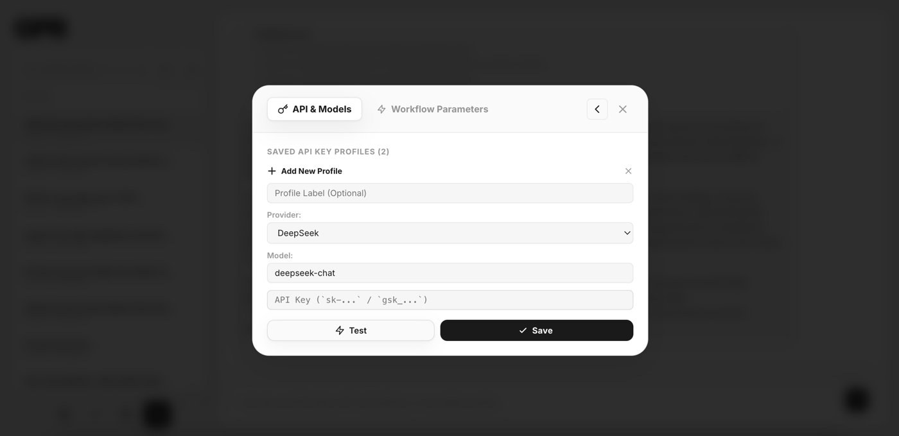

# GPR — General Purpose RAG & Grounded Knowledge Workspace

## Story-Driven Genesis

I built GPR because dense corporate manuals are hard to use in real work. A normal vector RAG chatbot can answer loosely, but it often loses table formulas, Arabic/English role names, reporting lines, and the exact reason behind an answer.

GPR solves that differently: it uses a curated relational knowledge graph, a live map, real streaming model responses, and exact citations back to approved organizational nodes.

This repository is the GPR chat workspace for Kayan Al-Mamlaka / Cyrkil-style internal knowledge use.

---

## Current Product Reality

- **No login UI.** The app remembers each browser/device.
- **API keys are stored in an encrypted server-side device vault.**
  - The browser gets a high-entropy HttpOnly device cookie.
  - Raw provider keys are encrypted at rest with AES-256-GCM.
  - Raw keys are not stored in browser localStorage after migration.
  - Chat requests use a vault profile id, not `X-LLM-API-Key`.
- **Streaming is real provider streaming.**
  - OpenAI-compatible providers stream deltas.
  - Gemini uses native streaming support.
  - The GUI renders received deltas as they arrive.
- **Knowledge base is an approved 80-node curated graph.**
  - The active source JSON is `uploads/deepseek_json_20260722_6a33e9.json`.
  - The production built graph is `src/backend/data/curated_knowledge_graph.json`.
- **The right panel is the live Map.**
  - Nodes show bilingual/enriched metadata, role profiles, KPIs, aliases, and relationships.

Security note: this is stronger than browser-local API keys, but it is still device-based, not user-login authentication. If the HttpOnly device cookie is stolen, that device can be impersonated.

---

## Product Preview

<p align="center">
  
</p>

The screenshot above shows the current encrypted API-key vault and workflow settings modal. It is intentionally the only large image in the README so the page stays clean and direct while still showing the product's monochrome, focused interface style.

## Key Capabilities

| Capability | Current implementation |
|---|---|
| Encrypted API-key vault | `src/backend/api/vault.py`, `services/vault_crypto.py`, `services/device_identity.py` |
| Device-only memory | `gpr_device_id` for local conversation history + HttpOnly `gpr_device_secret` for vault ownership |
| Real streaming chat | `src/backend/api/chat.py`, `agent/react_agent.py`, `services/provider_clients.py` |
| Bilingual graph data | enriched JSON fields: `name_ar`, `content_ar`, `keywords_ar`, `role_profile`, `kpis` |
| Graph viewer | `src/frontend/components/ObsidianGraphView.tsx` |
| Node/card inspector | `src/frontend/components/CitationDrawer.tsx` |
| Settings / profiles | `src/frontend/components/SettingsModal.tsx` |
| Frontend state | `src/frontend/context/AppContext.tsx` |

---

## Required Environment Variables

### Required in production

```bash
GPR_VAULT_MASTER_KEY=<base64url-encoded-32-byte-key>
```

Generate one locally:

```bash
python3 - <<'PY'
import base64, secrets
print(base64.urlsafe_b64encode(secrets.token_bytes(32)).decode().rstrip('='))
PY
```

Never commit this value.

### Recommended in production

```bash
GPR_ALLOWED_ORIGINS=https://your-gpr-domain.example
GPR_COOKIE_SECURE=true
DATABASE_URL=<optional postgres URL>
```

Local defaults allow:

```text
http://localhost:3000
http://127.0.0.1:3000
```

---

## Directory Structure

```text
gpr-general-purpose-rag/
├── Dockerfile
├── docker-entrypoint.sh
├── docker-compose.yml
├── railway.json
├── start.sh
├── README.md
├── _working_docs/
├── research/
├── uploads/
│   └── deepseek_json_20260722_6a33e9.json       # active enriched source JSON
├── src/backend/
│   ├── main.py
│   ├── api/
│   │   ├── vault.py
│   │   ├── chat.py
│   │   └── documents.py
│   ├── agent/
│   │   ├── prompts.py
│   │   └── react_agent.py
│   ├── services/
│   │   ├── vault_crypto.py
│   │   ├── device_identity.py
│   │   ├── provider_clients.py
│   │   └── ingestion/
│   ├── db/
│   ├── models/
│   ├── data/
│   │   ├── deepseek_json_20260722_6a33e9.json
│   │   └── curated_knowledge_graph.json
│   └── tests/
└── src/frontend/
    ├── app/
    ├── components/
    ├── context/
    └── utils/
```

---

## Local Development

### Backend tests

```bash
cd src/backend
export GPR_VAULT_MASTER_KEY="$(python3 - <<'PY'
import base64, secrets
print(base64.urlsafe_b64encode(secrets.token_bytes(32)).decode().rstrip('='))
PY
)"
export GPR_COOKIE_SECURE=false
PYTHONPATH=. pytest -q tests/
```

### Frontend build

```bash
cd src/frontend
npm install --legacy-peer-deps
npm run build
```

### Docker Compose

```bash
chmod +x start.sh
./start.sh
```

Open:

```text
http://localhost:3000
```

Then:

1. Open Settings.
2. Add a provider profile.
3. Test/save the key.
4. Ask a grounded question.
5. Watch the Map highlight inspected nodes.

---

## Railway Deployment

Railway should build the root `Dockerfile`. The repository includes `railway.json` for that path.

Steps:

1. Create a Railway project from this GitHub repository.
2. Use the root Dockerfile deployment.
3. Set `GPR_VAULT_MASTER_KEY`.
4. Set `GPR_ALLOWED_ORIGINS` to your live app origin.
5. Set `GPR_COOKIE_SECURE=true` for HTTPS.
6. Deploy.

---

## Active JSON Data Workflow

Ahmed edits:

```text
uploads/deepseek_json_20260722_6a33e9.json
```

The backend build process creates:

```text
src/backend/data/curated_knowledge_graph.json
```

The app supports enriched fields such as:

- Arabic title/content
- aliases
- Arabic/English keywords
- typed graph relations
- role profiles
- KPIs
- answerable questions
- not-answerable boundaries
- approval/confidence metadata

---

## Validation Before Merge

Required before pushing/merging to `main`:

```bash
cd src/backend
GPR_VAULT_MASTER_KEY=<test-key> GPR_COOKIE_SECURE=false PYTHONPATH=. pytest -q tests/

cd ../frontend
npm install --legacy-peer-deps
npm run build
```

Also run the repository secret scan and manual desktop/mobile checks.

---

## Copyright

All Rights Reserved © 2026.

This software and its curated knowledge graph are private intellectual property. Unauthorized copying, redistribution, reverse engineering, or commercial use is prohibited without written permission from the owner.
